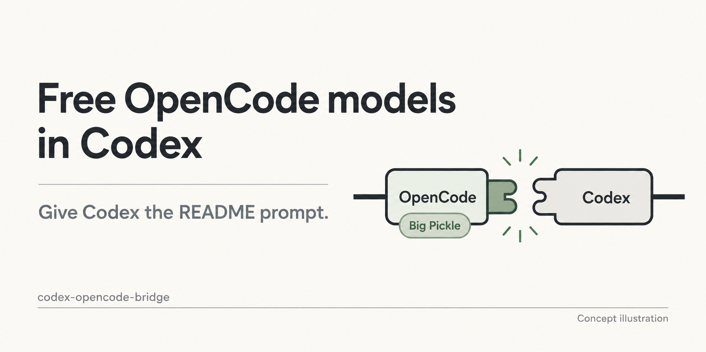

# Free OpenCode models in Codex

Keep using Codex, with a free model in its model menu.

Copy the prompt below and let Codex install the bridge. Reopen the app, pick
your installed model, and try it on a text or coding task. Your existing GPT models,
other providers and login stay in place.

You do not need to download this repository, open a terminal or edit configuration
before asking Codex to install it.

[中文说明](docs/README.zh-CN.md) · [Installation runbook](docs/agent-install.md)



*Big Pickle is shown as an example; other candidates are listed below.*

## Free models to try

Catalog and pricing checked **2026-10-01**. These models have bridge profiles;
their current access still needs a check during setup.

| Model | Route in this project |
| --- | --- |
| Big Pickle | Default. Recorded text and file checks passed. |
| Muse Spark 1.3 Contributor Free | Optional. Recorded image checks passed; the fresh no-login check was region-denied. |
| Space Bunny Free | Experimental text/tool route. Historical checks passed. |
| Nemotron 3 Ultra Free | Experimental text/tool route. Historical checks passed. |
| MiMo-V2.6-Flash Free | Experimental text/tool route. Historical checks passed. |
| LongCat 2.5 Preview Free | Experimental text/tool route. Historical checks passed. |

The last four were tested on earlier source revisions and have not been rerun
for this dated catalog check. Images are enabled only for the Muse route.
[Exact model IDs, other free catalog entries and evidence](docs/free-models.md).

Big Pickle is the default for a first install. To try another model in this table,
name it explicitly in the installation chat and ask Codex to follow the runbook,
verify text/file tasks, and report failures without silently changing models.

## 1. Let Codex install it

You need an installed Codex app and a working model to run the installation
prompt in a **local** chat. This installation guide targets **macOS Apple Silicon**.

Open a local chat in any project folder—even an empty one—and send this whole prompt:

```text
Install and configure codex-opencode-bridge in Codex on this Mac:
https://github.com/Hubuguilai/codex-opencode-bridge
Download the main branch, read README and docs/agent-install.md, and perform the
installation. I have not downloaded the project or prepared dependencies; handle those
for me rather than only giving instructions. Install Big Pickle by default; include
Muse only if I explicitly request it, and verify each selected model.
Use the maintained installer and preserve existing GPT models, other providers, login
and settings. You may run necessary model checks, but do not buy subscriptions, add
credit or enable paid fallback. If login or system authorization is needed, give me
one specific action at a time. Keys go only into a local login window, never this chat.
Report actual test results and the model name to select after reopening Codex.
Diagnose failures and repair reversible issues; state anything that still needs me.
```

Start with the default **Big Pickle**. You do not need to choose a model or buy an
OpenCode Go subscription first. Codex checks current access during setup.
If a login or an Apple developer-tools dialog is needed, complete that one action,
then return to the same chat so Codex can continue.

## 2. Reopen Codex and pick your model

After Codex reports passing checks, **fully quit and reopen the app**.
In the model menu beside the message box, select your installed model.
For the default installation, choose:

**Big Pickle (OpenCode Native Bridge)**

Start a new chat in an empty folder and send:

```text
Create hello.txt in this folder, write hello, then read it back to check the contents.
```

This checks that the selected model can use file tools, not just answer a greeting.
Once that works, try a small task in your own project: explain a script, edit a
function, or fix a failing check.

## What is verified?

Big Pickle answered without credentials in a fresh OpenCode home in our
2026-09-30 check. Actual Codex text/file tasks, repeat installation and uninstall
also passed using isolated client state.

The full first-time desktop installation on a separate Mac or a new macOS user
account, including reopening the app and observing its model menu, has not been
independently verified. This is an experimental prerelease, **0.2.0-rc.1**.

[Checks and receipts](docs/onboarding-verification.md) ·
[Verified scope and known limitations](docs/public-release.md)

## Questions and recovery

<details>
<summary>Is the default model free? Do I need an API key?</summary>

Big Pickle worked without an account or key in the check above. Free availability,
limits and regional access can change; the installer tests the route you can
actually use.

This gives Codex an OpenCode model option; it does not add quota to your GPT
subscription. No shared account or key is supplied.

If your selected route needs authentication, Codex provides a local login step.
Enter keys only there, never into chat. Buying Go, enabling billing or adding
credit is not a required installation step for the default route.

[Account and key instructions](docs/opencode-access.en.md)

</details>

<details>
<summary>Can I use images or another OpenCode model?</summary>

Big Pickle is for text, coding and file tasks; it does not support images.

The optional **Muse Spark 1.3 Contributor Free** model has an image route.
Our fresh unauthenticated check returned a country restriction. Confirm that this
exact model works in your OpenCode before adding it; logging in or paying is not
a guaranteed fix.

Append this to the installation prompt, or ask the same installation chat later:

> I confirmed Muse Spark 1.3 Contributor Free works in my OpenCode. Install it alongside Big Pickle and verify images too.

After successful checks, reopen Codex and select
**Muse Spark 1.3 Contributor Free (OpenCode Native Bridge)**.
Try a non-sensitive image and ask about its contents.

Big Pickle and Muse are the initial onboarding routes. The other four profiles
in the table above are experimental; other OpenCode catalog entries need adaptation
and verification before installation. Native audio, video and PDF input is unsupported.
Intel Macs are untested; Windows/Linux desktop setup is not covered by this guide.

[Model capabilities and evidence](docs/advanced.en.md)

</details>

<details>
<summary>The install failed, or the model appears but a task fails</summary>

Return to the installation chat and send:

```text
Diagnose my codex-opencode-bridge installation. Locate the existing checkout and
installation record, then read docs/agent-install.md and docs/troubleshooting.md.
Do not overwrite configuration or reinstall blindly. Check status, services,
model registration and the exact failing model/input. Distinguish download failures,
missing dependencies, OpenCode login, region/model permissions, rate limits,
unsupported images and stream errors. Never print keys, auth files or private
conversation logs. Use only the maintained reversible recovery commands. Tell me
what failed, what you repaired and verified, and the one action I need to take.
```

A menu entry or a running service alone does not confirm that a model works.
Use the actual task check and reported failure to decide what to do next.

</details>

<details>
<summary>How do I update or remove it?</summary>

Ask the same Codex installation chat to check health, upgrade and verify, or
uninstall while preserving your other models and login.
It should follow the [maintained runbook](docs/agent-install.md).

</details>

If you find it useful, give it a star. If something fails,
[open an issue](https://github.com/Hubuguilai/codex-opencode-bridge/issues) with the
model name and a redacted error message—leave out keys and private chat logs.
